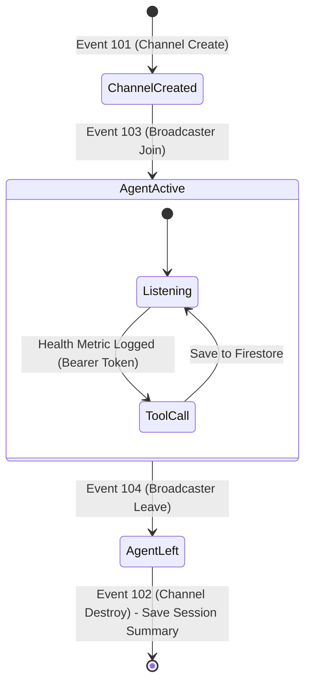

# 👵 Maa (MumAI Companion)


> An autonomous, ultra-low latency AI companion built for elder care, leveraging Agora's Conversational AI Engine, Gemini Pro, and dual-mode secure webhooks.

---

## 🏛️ System Architecture

Our architecture strictly decouples the client, server, and heavy AI compute to optimize for free-tier hosting (Vercel + Render) and ultra-low latency (Agora Edge).

```mermaid
graph TD
    User((👵 User)) <-->|RTC Voice / Ultra-Low Latency| AgoraEdge[Agora Edge Network]
    
    subgraph Vercel [Frontend PWA - Vercel]
        UI[React / Vite UI]
    end
    
    subgraph Render [Backend API - Render]
        API[Express Server]
        Auth[Token Generator]
        Webhook[Dual-Mode Webhook]
    end
    
    subgraph AgoraAI [Agora Conversational AI]
        STT[Speech-to-Text]
        LLM[Gemini Pro]
        TTS[Text-to-Speech]
    end
    
    subgraph GCP [Firebase]
        DB[(Firestore)]
    end

    User <-->|HTTPS UI| UI
    UI -->|Fetch Tokens & Start| API
    API -->|REST API| AgoraAI
    AgoraEdge <--> AgoraAI
    
    AgoraAI -->|1. LLM Tool Calls (Bearer)| Webhook
    AgoraEdge -->|2. RTC Events (HMAC)| Webhook
    Webhook -->|Persist Telemetry & State| DB
```

---

## 🔀 Webhook Event Lifecycle (State Machine)

Since Agora's Conversational AI Engine does not emit explicit "Agent Start/Stop" webhooks via the console, we proxy the agent's lifecycle using standard **RTC Channel Events**.



---

## 🗄️ Database Schema (Firestore)

<details>
<summary><strong>Click to expand Database Schema</strong></summary>

### `users/{userId}`
| Field | Type | Description |
| :--- | :--- | :--- |
| `displayName` | String | User's preferred name (e.g., "Maa") |
| `language` | String | e.g., "hi-IN", "en-US" |
| `emergencyContact` | String | Phone number for critical alerts |

### `users/{userId}/sessions/{sessionId}`
| Field | Type | Description |
| :--- | :--- | :--- |
| `startTime` | Timestamp | Triggered by Event 103 (Agent Joined) |
| `endTime` | Timestamp | Triggered by Event 104 (Agent Left) |
| `channelId` | String | The Agora RTC channel |

### `users/{userId}/health_metrics/{metricId}`
| Field | Type | Description |
| :--- | :--- | :--- |
| `metricType` | String | e.g., "blood_pressure", "sugar" |
| `value` | String | e.g., "120/80", "110" |
| `timestamp` | Timestamp | Logged automatically via Tool Call |

</details>

---

## 🔐 Environment Variables & Security (The Air-Gap)

Secrets are strictly air-gapped from the browser. The Vercel frontend only holds public identifiers.

### Frontend (Vercel)
| Variable | Required | Description |
| :--- | :--- | :--- |
| `VITE_AGORA_APP_ID` | Yes | Public Agora App ID for RTC connection. |
| `VITE_API_BASE_URL` | Yes | URL of your Render backend (e.g., `https://api.mumai.onrender.com`). |

### Backend (Render)
| Variable | Required | Description |
| :--- | :--- | :--- |
| `AGORA_APP_ID` | Yes | Agora App ID for token generation. |
| `AGORA_APP_CERTIFICATE`| Yes | Secure certificate for RTC/RTM tokens. |
| `AGORA_CUSTOMER_ID` | Yes | Agora REST API Customer ID. |
| `AGORA_CUSTOMER_SECRET`| Yes | Agora REST API Customer Secret. |
| `AGORA_WEBHOOK_SECRET` | Yes | Dual-mode signature/bearer token secret. |
| `FIREBASE_SERVICE_ACCOUNT`| Yes | Base64 encoded JSON for Admin SDK. |

---

## 📡 API Contracts (Webhook Dual-Mode)

Our `/api/agora/webhook` endpoint employs a **Security Sentinel Dual-Mode Authorization** pattern:
1.  **Custom LLM Tools (Episodic Memory):** Authenticated via `Authorization: Bearer <AGORA_WEBHOOK_SECRET>`.
2.  **Global RTC Events (Lifecycle Tracking):** Authenticated via HMAC SHA-1/SHA-256 signature matching the raw request body against the `Agora-Signature` header.

---

## 🚀 Deployment Runbook

### 1. Render (Backend API)
1. Connect your GitHub repository to Render.
2. Create a **Web Service**.
3. Build Command: `npm run build`
4. Start Command: `npm run start` (Executes `node dist/server.cjs`).
5. Inject all backend environment variables listed above.

### 2. Vercel (Frontend PWA)
1. Connect the same repository to Vercel.
2. Framework Preset: `Vite`.
3. Build Command: `npm run build`
4. Output Directory: `dist`
5. Set `VITE_API_BASE_URL` to point to your new Render URL.
6. **Important Security Note:** Ensure the Render Express server's `cors()` configuration whitelists your `.vercel.app` domain.
